```{r include=FALSE}
library(tidyverse)
library(leaflet)
library(leaflet.providers)
library(leaflet.extras)
library(icons)
library(tidyUSDA)
library(plotly)
# to read https://www150.statcan.gc.ca/n1/pub/95-640-x/2016001/article/14804-eng.htm
# https://www.thecanadianencyclopedia.ca/en/article/agriculture-in-canada#:~:text=Among%20Canada's%20top%20agricultural%20products,agricultural%20products%20in%20the%20world.
```


```{r setup, include=FALSE}
options(htmltools.dir.version = FALSE)
knitr::opts_chunk$set(
  fig.width=9, fig.height=3.5, fig.retina=3,
  out.width = "100%",
  cache = FALSE,
  echo = TRUE,
  message = FALSE, 
  warning = FALSE,
  hiline = TRUE
)
```

```{r xaringan-themer, include=FALSE, warning=FALSE}
#https://www.mcgill.ca/visual-identity/visual-identity-guide#:~:text=McGill%20red%20is%20CMYK%200,B47%20or%20Hexadecimal%20value%20%23ed1b2f.
library(xaringanthemer)
style_duo_accent(
  primary_color = "#ed1b2f",
  title_slide_background_color= "#FFF193",
  background_color = "#F4F4F4",
  secondary_color = "#333333",
  inverse_header_color = "#FFF193"
)
```


```{r meta, echo=FALSE}
library(metathis)
meta() %>%
  meta_general(
    description = "Oliveira's seminar at McGill University",
    generator = "xaringan and remark.js"
  ) %>% 
  meta_name("github-repo" = "maxwel/talks") %>% 
  meta_social(
    title = "Critical Weed-Free Periods in Crops",
    url = "https://mcgill-talk2.netlify.app/",
#    image = "https://arizona-talk.netlify.app/images/social-card.png",
    image_alt = "",
    og_type = "website",
    twitter_card_type = "summary_large_image",
    twitter_creator = "@maxwelco"
    ) %>% 
   include_meta()
```


```{r features, include=FALSE, warning=FALSE}
xaringanExtra::use_search(show_icon = TRUE,
                          position = "top-left")
xaringanExtra::use_webcam()
#xaringanExtra::use_freezeframe()
xaringanExtra::use_tile_view() # use letter O
xaringanExtra::use_share_again()
xaringanExtra::use_scribble() # use letter S
xaringanExtra::use_fit_screen()
xaringanExtra::use_broadcast() # use P
```


background-image: url(https://source.unsplash.com/hB3Dc62wc6s)
background-position: right
background-size: contain


## Outline


- Definition

- History

- Concept

- Data analyses

- Critical time for weed control in crops


.footnote[Image: Juan Rojas/Unsplash]


---

## Critical Weed-Free Periods 

#### Definition

- Period in the crop growth cycle during which weeds must be controlled to prevent crop yield losses (Zimdahl 1988)

--

.center[]


.footnote[Graph source: OMAFRA Agronomy Guide for field crops.]

---

## Crop-weed competition

- Competition for water, soil nutrients, light and etc

.center[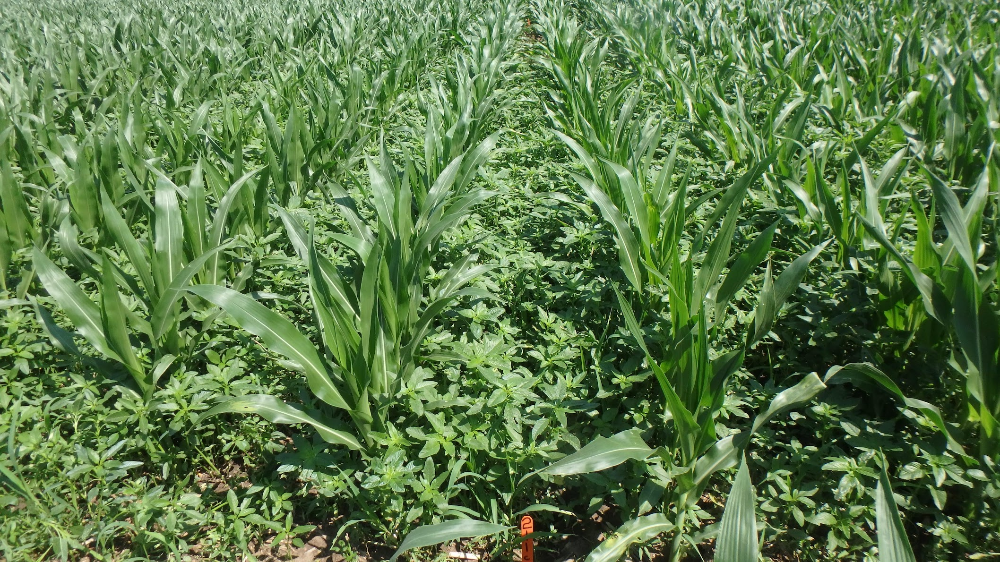]


---


## Critical Weed-Free Periods 


.center[**Critical Weed-Free Periods in Crops** is a key component in the **Integrated Weed Management**]

--

.center[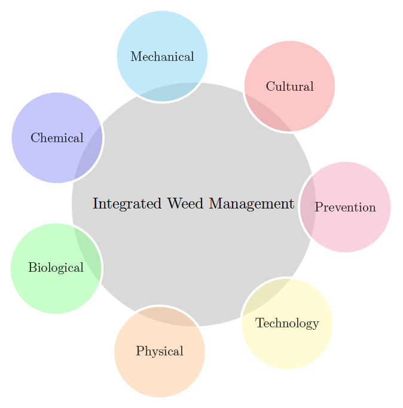]


---

background-image: url(images/velvet.jpeg)
background-position: right
background-size: contain

## Critical Weed-Free Periods 

#### History 

.pull-left[
- Concept introduced by [Nieto et al. (1968)](https://www.tandfonline.com/doi/abs/10.1080/05331856809432576?journalCode=ttpmc20)

> ... there are periods when weeds must be removed and other periods when the may be allowed to grow because they do not cause the slightest harm to the crop.

<br>

- [Zimdahl 1980](https://www.cabi.org/isc/abstract/19802329938) reviewed conducted studies but no practical use of the concept was reported

.footnote[Image: Velvet Weed (1915) by Hannah Borger Overbeck]

]


---
exclude: true
## Critical Weed-Free Periods

#### History 


- [Swanton and Weise 1991](https://www.jstor.org/stable/pdf/3987055.pdf?casa_token=bj6U2iSHE3AAAAAA:Sdo5kj1zA-MzQBPmGFUOHhHD4_EPC7KIG3u_7qmB4DmU9vrnfJXhS7bHMLOyz-W3-tdhk50CgaCgzYQH51s1VwXKGbaHRtM2-6DC377gYQy-Oea87ra3) reported:

> A growing awareness of environmental issues in Canada has had a major influence on government policies. An initiative was launched by the government of Ontario to promote research toward the development of an **integrated weed management** system.

<br><br>


---


## Critical Weed-Free Periods

#### History 

.pull-left[
- The use of postemergence herbicides with little residual activity in the 1990s reniewed the interest on the critical time for weed control in crops 


- Herbicide resistant crops were introduced and many studies were conducted to determine the most appropriate timing and periodicity for weed control


]


.pull-right[
.center[]
  
]

.footnote[Source: [Knezevic et al. 2002](https://digitalcommons.unl.edu/cgi/viewcontent.cgi?article=1407&context=agronomyfacpub)]

---

## Critical Weed-Free Periods

#### History 


.center[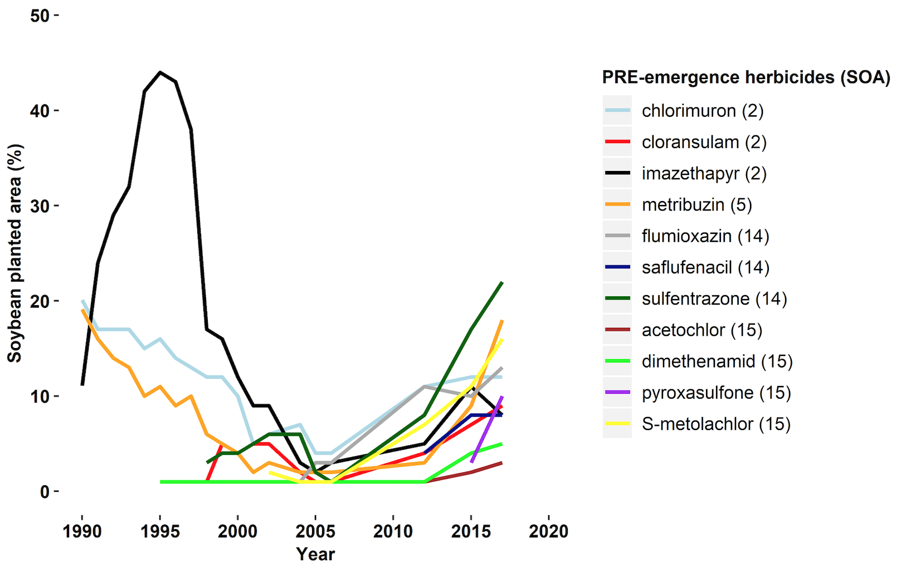]

.footnote[Image: Ribeiro et al., U of Wisconsin-Madison]

---

## Critical Weed-Free Periods in Crops

#### Historical reasons for studying

1. The potential to reduce the amount of herbicide used by achieving optimal application timing

--

1. The potential to reduce environmental and ecological degradation associated with the prophylactic use of herbicides

--

1. Provide a test to determine whether the methods of weed control are based on biological necessity

--

1. Need for the economic optimization of weed control tactics in herbicide tolerant crops through timely application of POST herbicides

.footnote[Source: [Knezevic et al. 2002](https://digitalcommons.unl.edu/cgi/viewcontent.cgi?article=1407&context=agronomyfacpub)]


---
exclude: true

##Weed management 


Heavily based on herbicides...


.center[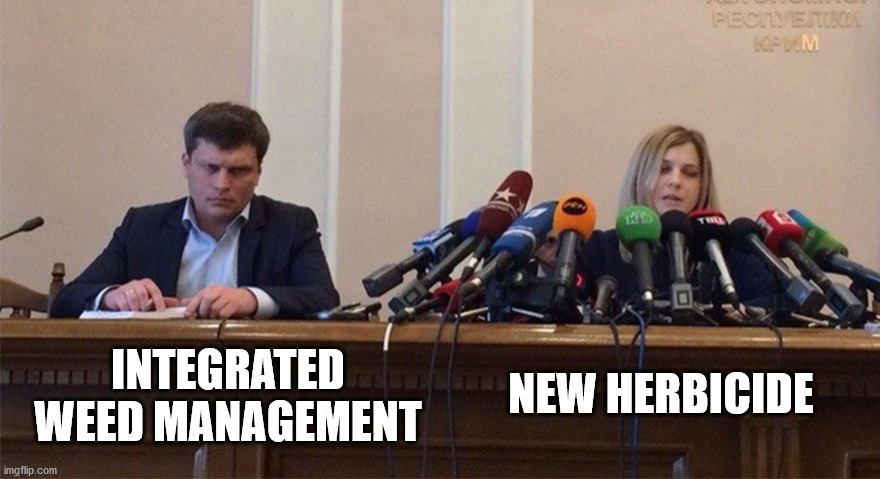]


---

## Assumptions and Limitations 

#### Crop and Weed Characteristics

.pull-left[
- Weed composition

- Time of emergence relative to the crop

- Crop variety
]

.pull-right[

.center[]

.footnote[Image: Steven Weeks/Unsplash]

]
  
---

## Assumptions and Limitations

#### Environment

.pull-left[
- Temperature

- Water availability

- Soil fertility
]

.pull-right[


.center[]

.footnote[Image: Steve Harvey/Unsplash]

]

---

## Assumptions and Limitations

#### Cultural Practices


.pull-left[

- Time of planting

- Tillage practice

- Soil nutrient

- Soil water content
]

.pull-right[

.center[]

.footnote[Image: Elizabeth Lies/Unsplash]

]

---

## Assumptions of Methodology

- The dynamics of weed species composition and the relative
time of emergence

--

- The way in which the **critical time for weed control** is determined from two separately measured components.


---

## Experimental Approach

- The **critical time for weed control** should be based primarily on the crop growth stage

--

- Typical Variables

  - Crop yield
  - Weed species density and composition
  - Date of weed and crop emergence in every experimental unit
  - Crop stage/height and weed height
  - Weed biomass
  - Environmental data

--
  
- Number of data points

  - Minimum 4 data points
  - Six to seven data points are ideal
  - Select two to three points clustered around the **early part** of the season, and two to three points clustered around the time of **crop canopy closure**
  
---

## Experimental Approach


.center[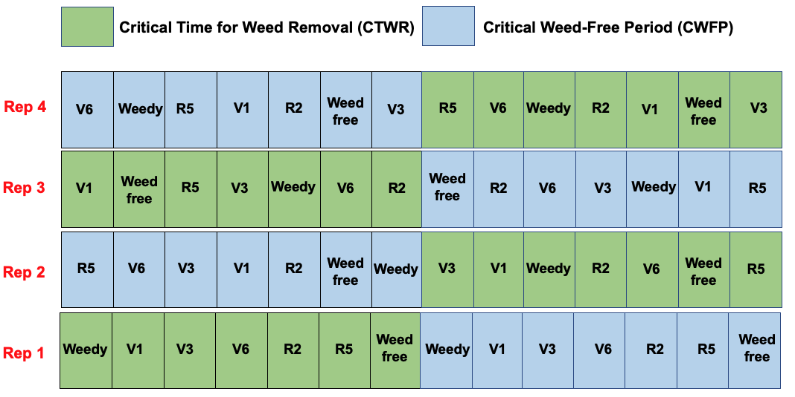]

---

## Experimental Approach


.center[]


---

## Statistical Analysis

#### Nonlinear regression analysis

  - Time of weed removal (x-axis) should be related to actual or relative crop yield (y-axis)
  - Growing degree days (GDD) accumulated from crop emergence or planting as the unit for time to quantify the duration of weed presence and length of the weed-free period (x-axis).

$$
GDD = \sum_{}^{}{(\frac{(Tmax + Tmin)}{2}) - Tbase}
$$

---

## Statistical Analysis

#### Nonlinear regression analysis

.pull-left[
- Sigmoid curve

- Logistic equation
    - Log-logistic model
    - Gompertz model
    - Weibull
    
- *drc* package in R
]


.pull-right[
.center[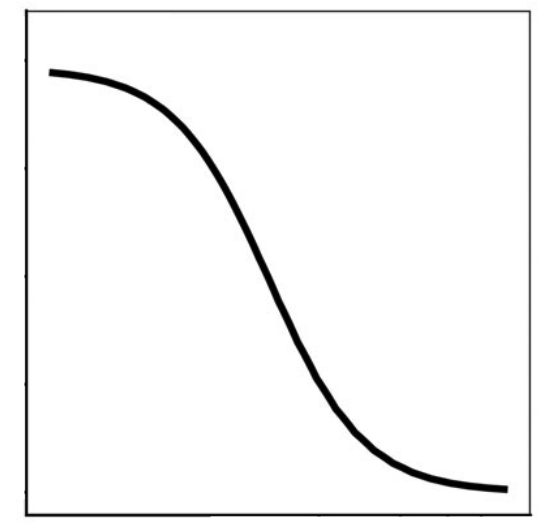]
]


---

## Critical Time for Weed Control 

#### Weedy curve

.pull-left[
.center[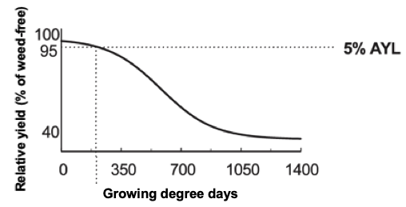]
]

.pull-right[
.center[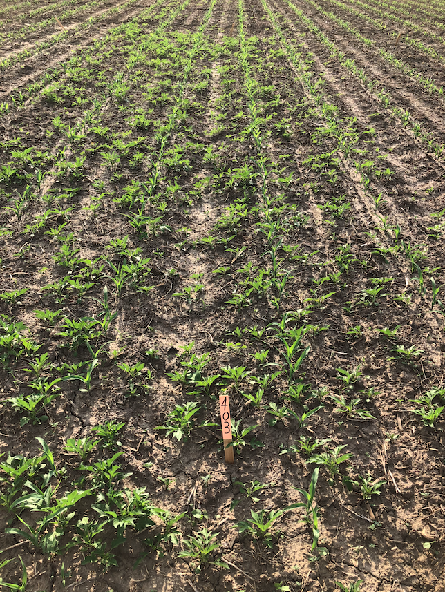]
]

The **critical timing of weed removal** or the maximum amount of time early-season weed competition can be tolerated by the crop before the crop suffers irrevocable yield reduction


.footnote[AYL, acceptable yield loss]


---

## Critical Weed-Free Periods in Crops

#### Weed-free curve


.pull-left[
.center[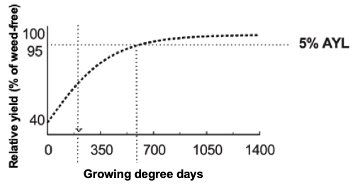]
]

.pull-right[
.center[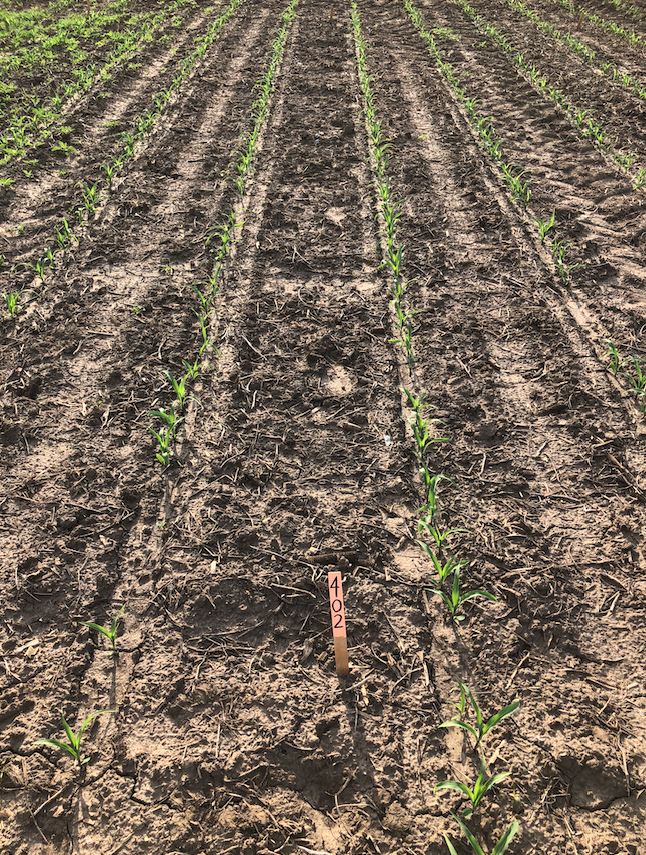]
]


The **critical weed-free period** or the minimum weed-free period required from the time of planting to prevent unacceptable yield reductions


.footnote[AYL, acceptable yield loss]


---

## Determination of Critical Weed-Free Periods in Crops


.pull-left[
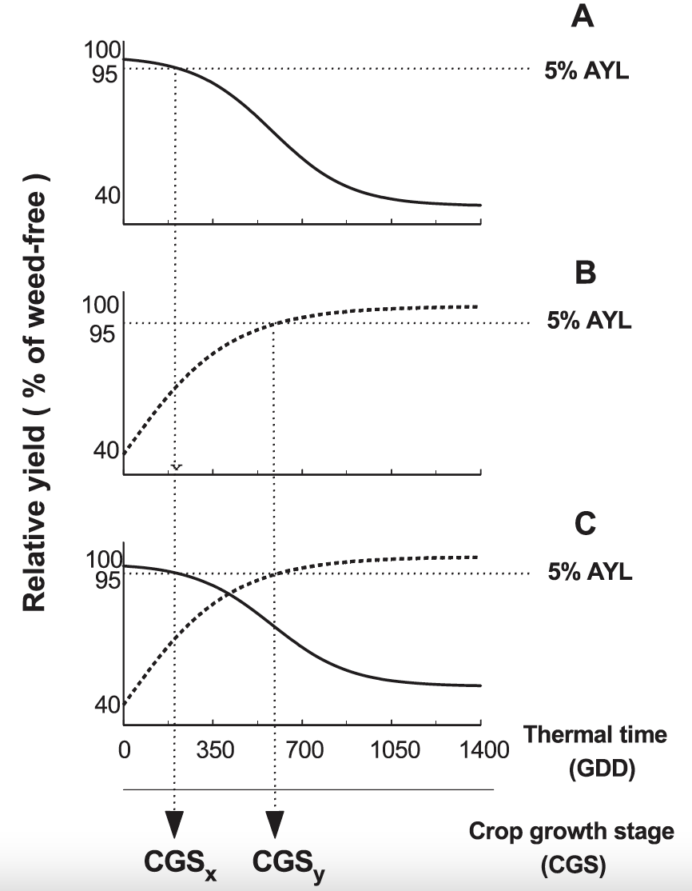
]

.pull-right[
- **A**: Weedy curve (––; descending line)  


- **B**: Weed-free curve (- - -; ascending line)  


- **C**: The value of the x-axis that corresponds to the 95% relative yield
or an acceptable yield loss (AYL) of 5% is determined for both curves and related to crop growth stage (CGS).


.footnote[Source: Knezevic and Datta, 2015]

]


---

## Determination of Critical Weed-Free Periods in Crops

- The combination of **weedy** and **weed-free** curve generates the critical time for weed control

.center[]


.footnote[Graph source: OMAFRA Agronomy Guide for field crops.]

---
background-image: url(https://source.unsplash.com/EK8QN9O0wRk)
background-position: right
background-size: contain


## Acceptable Yield Loss

.pull-left[
- The begining of critical time for weed control will depend on the level of acceptable yield loss

  - Most of studies report anywhere from 2 to 10% the maximum acceptable yield loss
  
  - Can be adjust depending on the cost of control and the anticipated financial gain

.footnote[Image: Markus Spiske/Unsplash]
]


---

## Critical Weed-Free Periods in Canola

.pull-left[

#### Study in Manitoba, CAN

- 10% acceptable yield loss

- Canola must be kept weed-free in most cases until the four-leaf stage of the crop (17–38 days after crop emergence)

- In one early-seeded experiment, until the six-leaf stage of the crop (days after crop emergence)

- Few weeds emerged after four to six-leaf stage
]


.pull-right[
.center[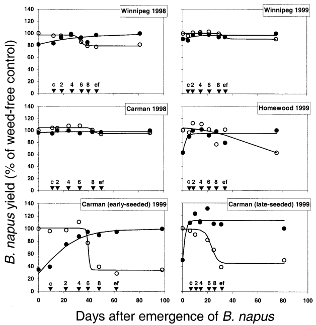]
]


.footnote[Source: [Martin et al., 2001](https://www.cambridge.org/core/journals/weed-science/article/abs/critical-period-of-weed-control-in-spring-canola/BF217C1AC41A47902D91995CB79369E3)

]

---

## Critical Weed-Free Periods in Soybean

.pull-left[

#### Study in Ontario, CAN

- 2.5% acceptable yield loss

- The **critical time for weed control** ranged from V2 to R3 (9 to 38 days after emergence)

]


.pull-right[
.center[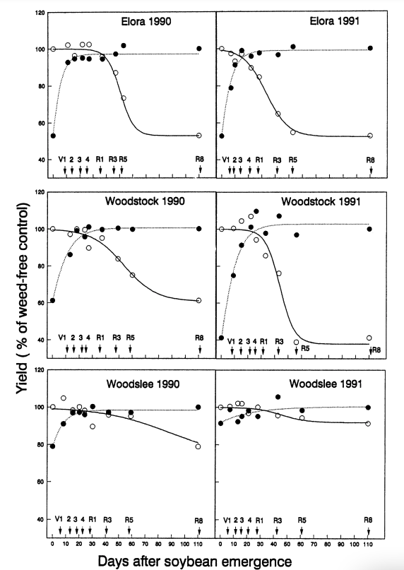]
]


.footnote[Source: [Van Acker et al., 1993](https://www.jstor.org/stable/pdf/4045304.pdf?casa_token=ZYxgL_6QHm0AAAAA:oPo_po_vESH0y0HR7vEBwY1ntustQP45hxXl-bNGYykL-3bMnO2Gd2UkJTotEQb06ZsPxGmoWeaN-im4usQ5aqupYslHByMPpT5_LuKdK41c3Eedpgy9)]]


---

## Critical Time for Weed Removal in Soybean

#### Influenced by row width

.pull-left[
- **76 cm rows**: V1 soybean stage
- **38 cm rows**: V2 soybean stage
- **19 cm rows**: V3 soybean stage
]


.pull-right[
.center[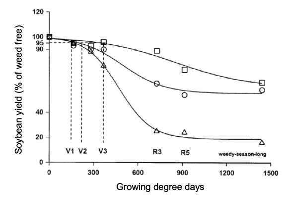]
]


.footnote[[Knezevic et al (2003)](https://www.mssoy.org/uploads/files/knezevic-2003-ne-rs-weed-mgmt_1.pdf)]

---

## Critical Time for Weed Removal in Soybean

#### Influenced by row width


.center[
<iframe width="600" height="355" src="https://www.youtube.com/embed/WMlRD1CElrs";start=2" frameborder="0" allow="accelerometer; autoplay; encrypted-media; gyroscope; picture-in-picture" allowfullscreen></iframe>
]


.footnote[Source: Nikola Arsenijevic/U of Wisconsin-Madison]
---


## Critical Time for Weed Removal in Soybean

#### Influenced by preemergence applied herbicides

.pull-left[
- Study conducted in Nebraska, USA
  - Three locations
  - Three to four years

- Results showed that the critical time for weed removal 
  - **Without preemergence**: V1 to V2 (14 to 21 DAE)
  - **With preemergence** V4 (28 DAE) stage up to the R5 (66 DAE) stage
]


.pull-right[
.center[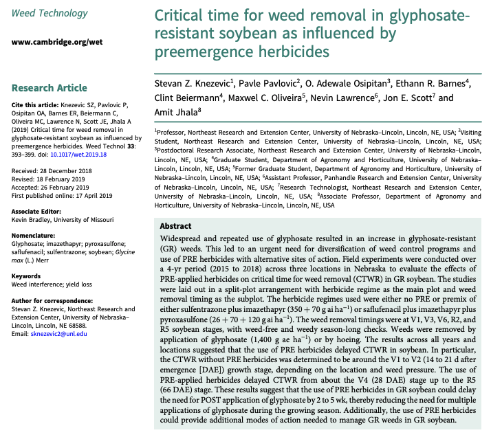]
]


---

## Critical Time for Weed Removal in Soybean

#### Influenced by residual applied herbicides


.center[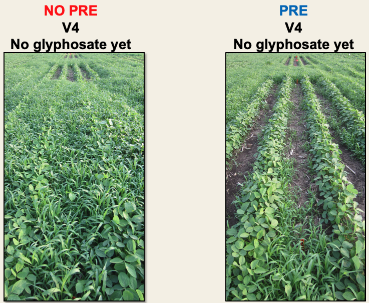]

.footnote[Image: Oliveira et al, 2015]


---

## Critical Time for Weed Removal in Soybean

#### Influenced by residual applied herbicides


.center[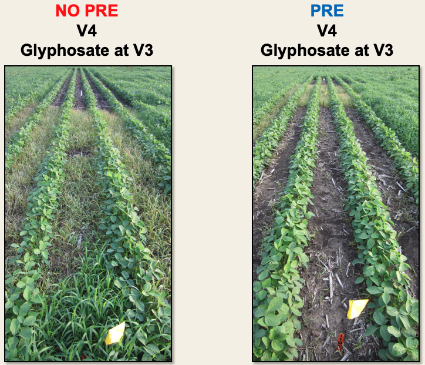]

.footnote[Image: Oliveira et al, 2015]


---

## Critical Time for Weed Removal in Soybean

#### Influenced by residual applied herbicides


.center[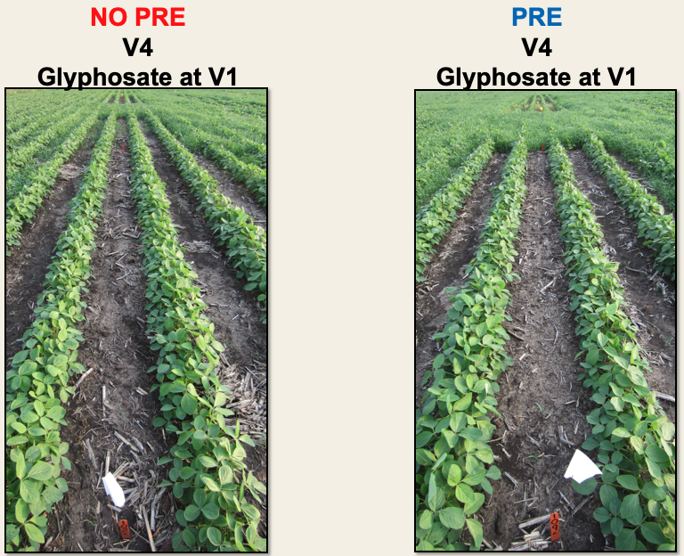]

.footnote[Image: Oliveira et al, 2015]


---

## Critical Time for Weed Removal in Cotton

#### Influenced by residual applied herbicides


.center[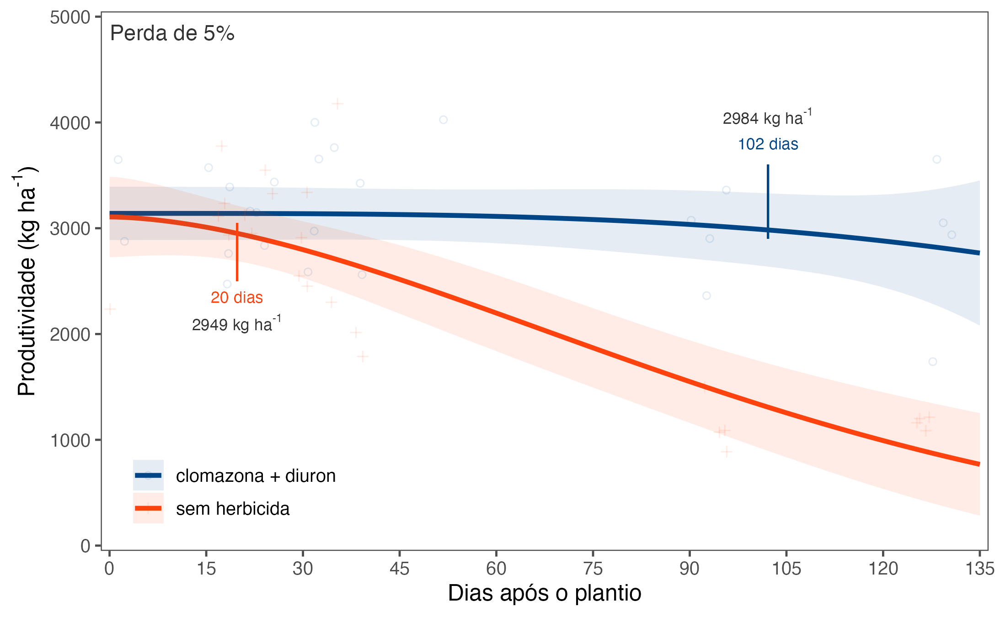]

.footnote[Source: Mendonça and Oliveira, unpublished]


---

## Take Home Message

- The **Critical Weed-Free Periods** is best described with a sigmoid regression curve
 
<br>

--

- The **Critical Weed-Free Periods** vary with location, time and management practices

<br>

--

- The **Critical Weed-Free Periods** has the potential to influence decision making on the timing of postemergence weed management

<br>

--

- The **Critical Weed-Free Periods** is an import part of the integrated weed management

<br>

--

- Zero weed tolerance (herbicide resistant weeds) has brought the need of clean fields, reducing use of the **Critical Weed-Free Periods** concept 

---

## Zero weed tolerance

.center[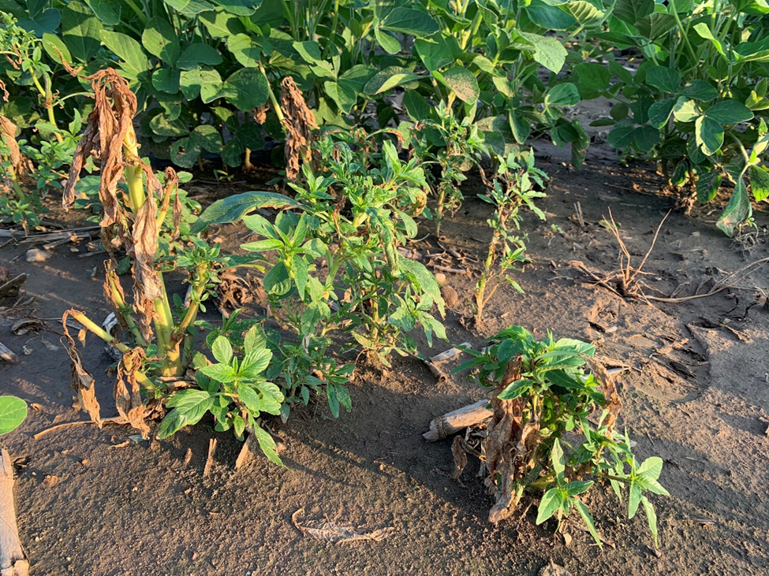]

---
exclude: true
## References

- Knezevic SZ, Evans SP, Blankenship EE, Van Acker RC, Lindquist JL (2002) Critical period of weed control: the concept and data analysis. Weed Sci 50:773–786

- Knezevic SZ and Datta A (2015) The critical period for weed control: Revising data analysis. Weed Sci Sp:188–202

- Knezevic SZ, Pavlovic P, Osipitan OA, Barnes ER, Beiermann C, Oliveira MC, Lawrence N, Scott JE, Jhala AJ (2019) Critical time for weed removal in glyphosate-resistant soybean as influenced by preemergence herbicides. Weed Technol 33:393–399

- Martin, S. G., R. C. Van Acker, and L. F. Friesen. 2001. Critical period of weed control in spring canola. Weed Sci. 49:326–333.

- Nieto, H. J., M. A. Brondo, and J. T. Gonzales. 1968. Critical periods of the crop growth cycle for competition from weeds. PANS (C) 14:159–166.

- Zimdahl, R. L. 1980. Weed–Crop Competition—A Review. Corvallis, OR: International Plant Protection Center, Oregon State University. 195 p.

- Van Acker, C. R., C. J. Swanton, and S. F. Weise. 1993. The critical period of weed control in soybean [Glycine max (L.) Merr.]. Weed Sci. 41:194–200.

- Zimdahl RL (1988) The concept and application of the critical weed-free period. Pages 145–155 in Altieri MA and Liebmann M, eds. Weed Management in Agroecosystems: Ecological Approaches. Boca Raton, FL: CRC Press


---

name: goodbye
class: right, middle, blue


# Thank you!

#### You can find me at...

[`r icon_style(fontawesome("github"), style = "solid")` @maxwelco](https://github.com/maxwelco)  
[`r icon_style(fontawesome("twitter"), style = "solid")` @maxwelco](https://twitter.com/maxwelco)  
[`r icon_style(fontawesome("link"), style = "solid")` maxweeds.rbind.io](https://maxweeds.rbind.io)  
[`r icon_style(fontawesome("envelope-square"), style = "solid")` maxwelco@gmail.com](mailto:maxwelco@gmail.com)
